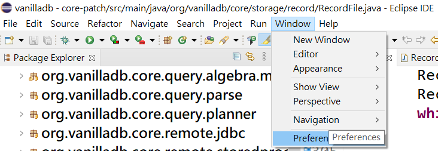
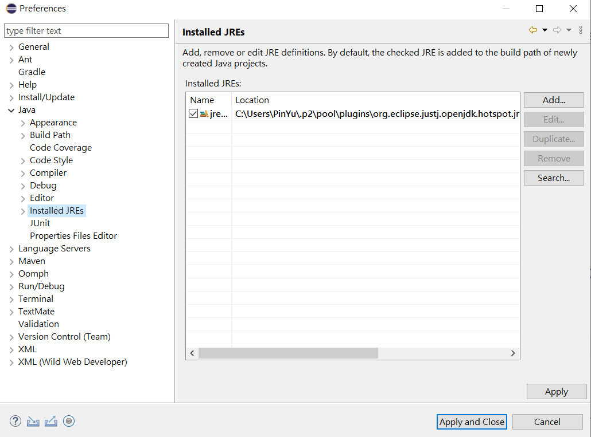
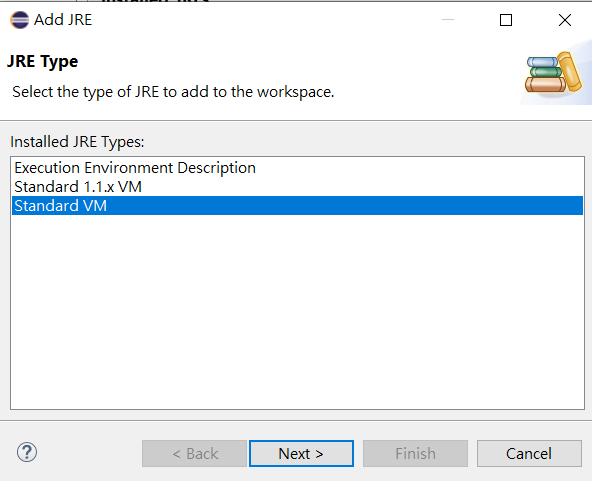
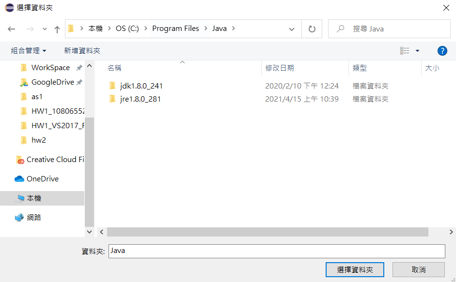
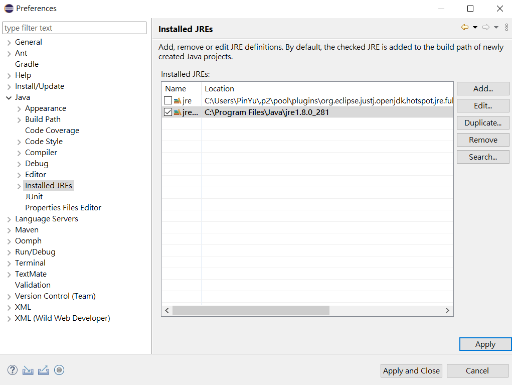
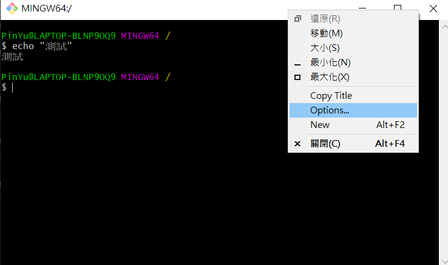
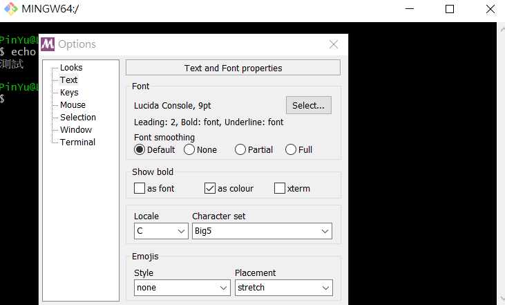

# Assignment 3

## FAQ
### Question 1: 啟動 server.jar 錯誤
> M 君：為什麼啟動 server 的時候一直報錯，出現 `Caused by: java.lang.NoSuchMethodError: java.nio.ByteBuffer.position(I)Ljava/nio/ByteBuffer;`

因為同學打包 server.jar 用到 java 11 的 (java runtime environment) jre。

在 jre 11 中，java.nio 這個 library 有小幅度修正 api，像是 java.nio.ByteBuffer 已經沒有 position 這個 method 了。所以我們要把 eclipse 內的 jre 切回 jre 1.8。

- step 1
安裝 java development kit 1.8

- step 2
切換 eclipse default runtime
    - 開啟 preference

    - 選擇 Installed JREs

    - add JREs

    - 選擇 `/c/Programe File/Java/jdk` 或 `/c/Programe File/Java/jre`
        - jdk 和 jre 都可以選

    - 確認選擇

### Question 2: git bash 中文亂碼
- gitbash 上方右鍵選 options

- 選擇 text 並將 character set 設成 big5

- 重開 gitbash

