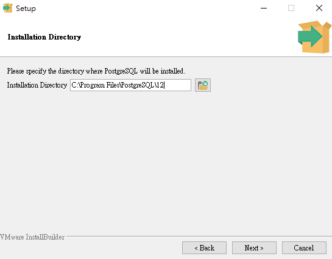
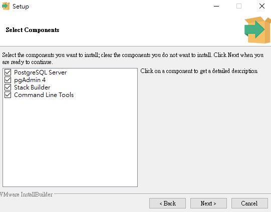
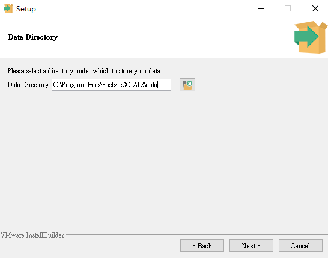
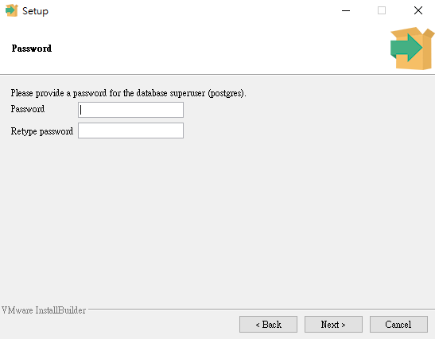
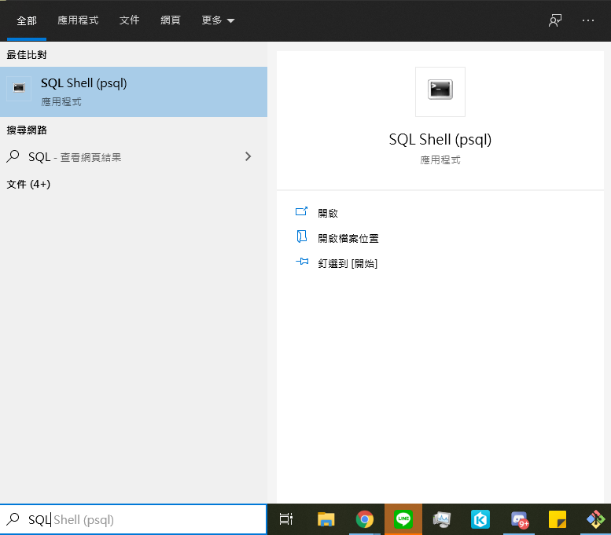
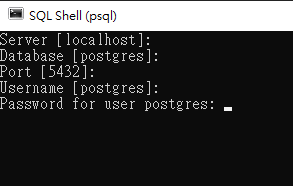
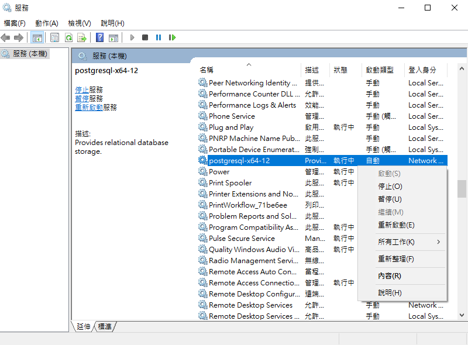

# PostgreSQL 12/13 安裝教學 - Windows

## 下載 PostgreSQL 12/13
點選 [連結](https://www.enterprisedb.com/downloads/postgres-postgresql-downloads)
選擇 Version 12.X - Windows x86-64 或 Version 13.X - Windows x86-64

`以下用 PostgreSQL 12 為範例`

## 使用安裝程式安裝
1. 使用預設 installation directory，下一步。
  
2. 選擇 4 個 components，下一步。
  
3. 選擇預設 data directory，下一步。
  
3. 輸入 superuser: postgres 的密碼，下一步。
  

4. Port 請使用 default port: 5432，下一步。

5. Locale 請選擇 Default Locale。

6. 一路下一步至安裝結束。

7. 若出現 stackbuilder 安裝介面，可以先忽略。

## 現在什麼狀況？
當前一個步驟安裝好後，電腦會有一個 postgreSQL service 在背景執行，這個 service 會等待 client 來連線。

在剛裝好的 service 中存在一個預設的 database 叫做 `postgres`，也存在一個預設 superuser 叫做 `postgres`，密碼是安裝時輸入的。

一個 postgreSQL service 可以有很多 databases，一個 database 中可以有很多 tables。

## 如何進入 SQL Console 的介面
現在我們要打開 SQL Console (client)，有兩種方法可以進入 SQL Console，這兩種方法本質上都是藉由 `psql.exe` 這個 client 程式來連結 server。

### 方法 1，打開 SQL shell

一直按 enter 直到輸入密碼的時候再輸入密碼就好，中括號內是預設值。

輸入密碼成功後，即可進入 SQL Console 畫面。

### 方法 2，打開一般的 terminal(cmd)
輸入 `C:\Program Files\PostgreSQL\12\bin\psql.exe -U postgres`，接著輸入密碼。

即可進入 SQL Console 畫面

## 常見問題
* **pg_ctl: directory "C:/Program Files/PostgreSQL/12/data" is not a database cluster directory**

  請以系統管理員打開 cmd 下指令 `C:\Program Files\PostgreSQL\12\bin\initdb.exe -D "C:\Program Files\PostgreSQL\12\data"`

* **Postgres Service 沒有成功啟動**
Serveice 沒啟動，Client 不可能連上的喔~
- 請至桌面左下方搜尋欄輸入 `services.msc`，找到 postgresql-x64-12 後，右鍵選取啟動。

- 如果沒有出現 postgresql-x64-12，請以系統管理員打開 cmd 下指令`pg_ctl -D ^"C^:^\Program^ Files^\PostgreSQL^\12^\data^" register`

* **role "postgres" does not exist**
    請以系統管理員打開 cmd 下指令 `"C:\Program Files\PostgreSQL\12\bin\createuser.exe" -s postgres`

* **密碼輸入持續報錯**
如果輸入密碼出現 `FATAL: password authentication failed for user "postgres"`

- 請參考
  - https://www.programmersought.com/article/56775309737/
  - 簡單來說，就是藉由設定 pg_hba.conf 來繞過打密碼的步驟。
    - [pg_hba.conf 詳細介紹](https://docs.postgresql.tw/server-administration/client-authentication/the-pg_hba.conf-file)
  - 連進去之後可以藉由下 `ALTER ROLE postgres WITH PASSWORD 'my_password';` 來改密碼。

* **還有問題？**
    - 建議解除安裝後，再重新安裝。