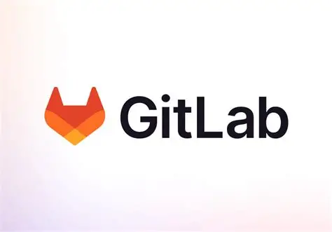

# 🦊 GitLab NTHU - 吳尚鴻

  

GitLab is a DevOps platform that provides Git repository hosting plus collaboration and automation tools in one place.  
 

This repository documents and archives course materials from Prof. 吳尚鴻’s classes (Software Studio and Database), which use a private GitLab instance as an assignment platform.  
This repo collects past templates/problems and (where applicable) my completed implementations for learning, review, and reference.  
   

## ⚠️ !!! DISCLAIMER !!!
- This collection is not guaranteed to be complete.
- Some assignments may include answer keys / full solutions, but accuracy is not guaranteed. Use them as reference only.
- Always verify behavior using the official course handouts, constraints, and your own testing/analysis.
- This repo is intended for learning and review. We DO NOT CONDONE dishonest use (copy-pasting for graded submissions, bypassing course rules, or violating academic integrity policies).
- If you are currently taking the course, follow the instructor/TA rules and your school’s academic integrity policy.
- We are not liable for any consequences arising from misuse.

If this repo helps you learn the material more effectively and build stronger fundamentals, that’s the goal. ✅

  

## Software Studio
In Software Studio, the course work commonly focuses on Flutter and Dart. Using Flutter’s UI framework and Dart as the programming language.  

### 🌸 Spring 2024

<strong>Dropdown Menu</strong>

| Names                             | Topics                | Examples                                                                  | Labs                                                              | Solutions                          |
|-----------------------------------|-----------------------|---------------------------------------------------------------------------|:-----------------------------------------------------------------:|:----------------------------------:|
| Lab 00 - Submission Exercise      | -                     | -                                                                         | [Download][SS_Lab_2024_Lab00], [GitLab][SS_GitLab_Lab_2024_Lab00] | [Solution][SS_Solution_2024_Lab00] |
| Lab 01 - Roll Dice App            | Stateless Vs Stateful | [Download][SS_Example_2024_Lab01], [GitLab][SS_GitLab_Example_2024_Lab01] | [Download][SS_Lab_2024_Lab01], [GitLab][SS_GitLab_Lab_2024_Lab01] | [Solution][SS_Solution_2024_Lab01] |
| Lab 02 - Quiz App                 | -                     | [Download][SS_Example_2024_Lab02], [GitLab][SS_GitLab_Example_2024_Lab02] | [Download][SS_Lab_2024_Lab02], [GitLab][SS_GitLab_Lab_2024_Lab02] | -                                  |
| Lab 03 - Expense Tracker          | -                     | [Download][SS_Example_2024_Lab03], [GitLab][SS_GitLab_Example_2024_Lab03] | [Download][SS_Lab_2024_Lab03], [GitLab][SS_GitLab_Lab_2024_Lab03] | -                                  |
| Lab 04 - Expense Tracker Parallax | -                     | [Download][SS_Example_2024_Lab04], [GitLab][SS_GitLab_Example_2024_Lab04] | [Download][SS_Lab_2024_Lab04], [GitLab][SS_GitLab_Lab_2024_Lab04] | -                                  |
| Lab 05 - OpenAI API               | -                     | [Download][SS_Example_2024_Lab05], [GitLab][SS_GitLab_Example_2024_Lab05] | [Download][SS_Lab_2024_Lab05], [GitLab][SS_GitLab_Lab_2024_Lab05] | -                                  |
| Lab 07 - Meals App                | -                     | [Download][SS_Example_2024_Lab07], [GitLab][SS_GitLab_Example_2024_Lab07] | [Download][SS_Lab_2024_Lab07], [GitLab][SS_GitLab_Lab_2024_Lab07] | -                                  |
| Lab 08 - Meals App Animation      | -                     | [Download][SS_Example_2024_Lab08], [GitLab][SS_GitLab_Example_2024_Lab08] | -                                                                 | -                                  |
| Lab 09 - Group Todo List          | -                     | [Download][SS_Example_2024_Lab09], [GitLab][SS_GitLab_Example_2024_Lab09] | -                                                                 | -                                  |

---

 

[SS_Solution_2024_Lab00]: Software_Studio/Labs_Solutions/Spring_2024/Lab00_Solution_Submission_Exercise
[SS_Solution_2024_Lab01]: Software_Studio/Labs_Solutions/Spring_2024/Lab01_Solution_Flutter_Basics_Dart_Roll_Dice_App

[SS_Lab_2024_Lab00]: Software_Studio/Labs/Spring_2024/Lab00_Lab_Submission_Exercise.zip
[SS_Lab_2024_Lab01]: Software_Studio/Labs/Spring_2024/Lab01_Lab_Flutter_Basics_Dart_Roll_Dice.zip
[SS_Lab_2024_Lab02]: Software_Studio/Labs/Spring_2024/Lab02_Lab_Flutter_Basics_Dart_Quiz.zip
[SS_Lab_2024_Lab03]: Software_Studio/Labs/Spring_2024/Lab03_Lab_Flutter_Basics_Dart_Expense_Tracker
[SS_Lab_2024_Lab04]: Software_Studio/Labs/Spring_2024/Lab04_Lab_Flutter_Basics_Dart_Expense_Tracker_Parallax
[SS_Lab_2024_Lab05]: Software_Studio/Labs/Spring_2024/Lab05_Lab_Flutter_Basics_Dart_OpenAI_API
[SS_Lab_2024_Lab07]: Software_Studio/Labs/Spring_2024/Lab07_Lab_Flutter_Basics_Dart_Meals_App

[SS_GitLab_Lab_2024_Lab00]: https://shwu10.cs.nthu.edu.tw/courses/software-studio/2024-spring/submission-exercise
[SS_GitLab_Lab_2024_Lab01]: https://shwu10.cs.nthu.edu.tw/syteng/lab-flutter-basics-dart-roll-dice-app
[SS_GitLab_Lab_2024_Lab02]: https://shwu10.cs.nthu.edu.tw/syteng/lab-flutter-basics-dart-quiz-app
[SS_GitLab_Lab_2024_Lab03]: https://shwu10.cs.nthu.edu.tw/syteng/lab-flutter-basics-dart-expense-tracker
[SS_GitLab_Lab_2024_Lab04]: https://shwu10.cs.nthu.edu.tw/syteng/lab-flutter-basics-dart-expense-tracker-parallax
[SS_GitLab_Lab_2024_Lab05]: https://shwu10.cs.nthu.edu.tw/syteng/lab-flutter-basics-dart-openai-api
[SS_GitLab_Lab_2024_Lab07]: https://shwu10.cs.nthu.edu.tw/syteng/lab-flutter-basics-dart-meals-app

[SS_Example_2024_Lab01]: Software_Studio/Examples/2024_Spring/Lab01_Example_Flutter_Basics_Dart_Roll_Dice_App.zip
[SS_Example_2024_Lab02]: Software_Studio/Examples/2024_Spring/Lab02_Example_Flutter_Basics_Dart_Quiz_App.zip
[SS_Example_2024_Lab03]: Software_Studio/Examples/2024_Spring/Lab03_Example_Flutter_Basics_Dart_Expense_Tracker.zip
[SS_Example_2024_Lab04]: Software_Studio/Examples/2024_Spring/Lab04_Example_Flutter_Basics_Dart_Expense_Tracker_Parallax.zip
[SS_Example_2024_Lab05]: Software_Studio/Examples/2024_Spring/Lab05_Example_Flutter_Basics_Dart_Openai_Api.zip
[SS_Example_2024_Lab07]: Software_Studio/Examples/2024_Spring/Lab07_Example_Flutter_Basics_Dart_Meals_App.zip
[SS_Example_2024_Lab08]: Software_Studio/Examples/2024_Spring/Lab08_Example_Flutter_Basics_Dart_Meals_App_Animation.zip
[SS_Example_2024_Lab09]: Software_Studio/Examples/2024_Spring/Lab09_Example_Flutter_Basics_Dart_Group_Todo_List.zip

[SS_GitLab_Example_2024_Lab01]: https://shwu10.cs.nthu.edu.tw/courses/software-studio/2024-spring/lab-flutter-basics-dart-roll-dice-app-example
[SS_GitLab_Example_2024_Lab02]: https://shwu10.cs.nthu.edu.tw/courses/software-studio/2024-spring/lab-flutter-basics-dart-quiz-app-example
[SS_GitLab_Example_2024_Lab03]: https://shwu10.cs.nthu.edu.tw/courses/software-studio/2024-spring/lab-flutter-basics-dart-expense-tracker-example
[SS_GitLab_Example_2024_Lab04]: https://shwu10.cs.nthu.edu.tw/courses/software-studio/2024-spring/lab-flutter-basics-dart-expense-tracker-parallax-example
[SS_GitLab_Example_2024_Lab05]: https://shwu10.cs.nthu.edu.tw/courses/software-studio/2024-spring/lab-flutter-basics-dart-openai-api-example
[SS_GitLab_Example_2024_Lab07]: https://shwu10.cs.nthu.edu.tw/courses/software-studio/2024-spring/lab-flutter-basics-dart-meals-app-example
[SS_GitLab_Example_2024_Lab08]: https://shwu10.cs.nthu.edu.tw/courses/software-studio/2024-spring/lab-flutter-basics-dart-meals-app-animation-example
[SS_GitLab_Example_2024_Lab09]: https://shwu10.cs.nthu.edu.tw/courses/software-studio/2024-spring/lab-flutter-basics-dart-group-todo-list-example