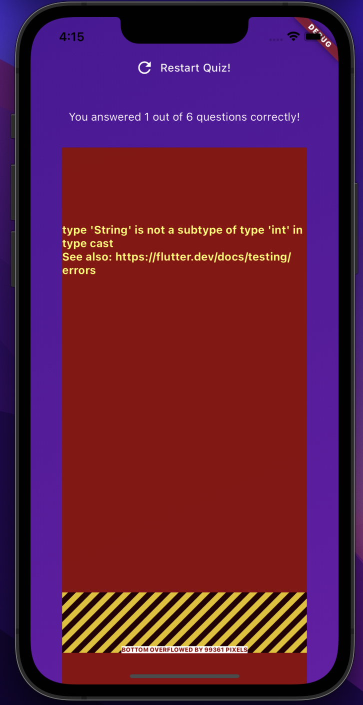
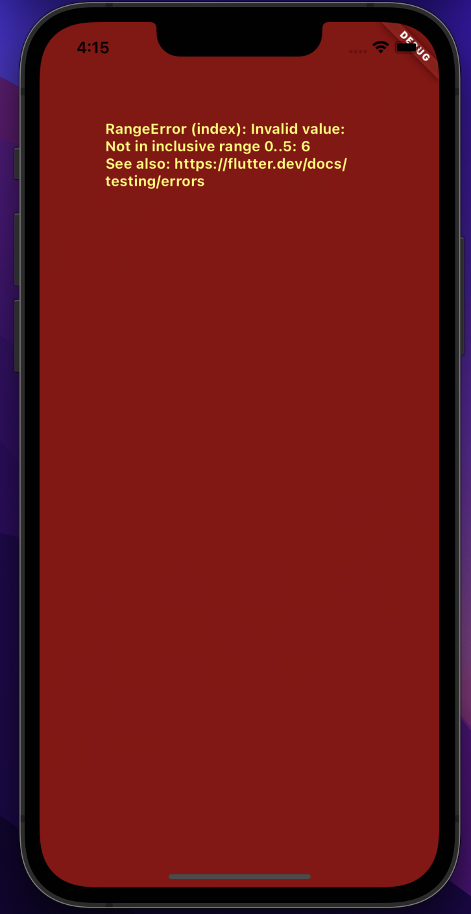
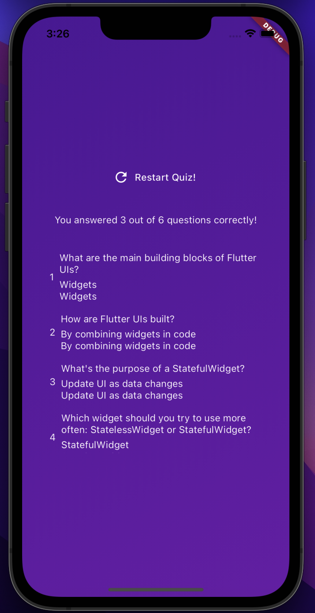
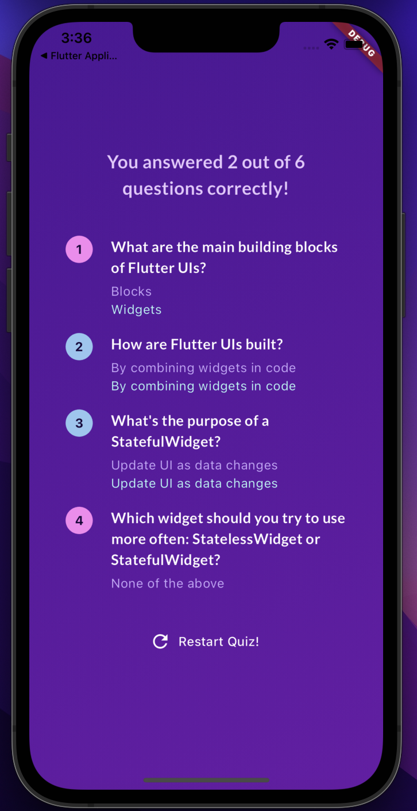

# Lab 02 Quiz app - example

During this lab session, you will address **two bugs** in the quiz application discussed in class. The lab project (courses > software-studio > 2025-spring > lab-flutter-basics-dart-quiz-app) provides the quiz application with pre-existing bugs.

The first part is to **resolve the error** that occurred during the **initial round**, described as follows:

 ( 20% )  
   

During the **subsequent round** of troubleshooting, an error, illustrated in the figure below, is expected to manifest:

 ( 20% )  
   

 ( 60% )  

The second part is to **enhance the appearance of the ResultsScreen**. A comparison between the **original screen** and the **desired outcome** is provided:

   
   

Adjustments include 

 ( 20% ) modifying the **font size** of the title (including the number of correct answers and the question title).   

 ( 20% ) Additionally, display a **circular background** behind the question index. **Different colors**(Correct -> Color.fromARGB(255, 150, 198, 241), Wrong -> Color.fromARGB(255, 249, 133, 241)) will be used to indicate correctness or errors.  

 ( 20% ) The **user's selected option** should be represented in a **translucent purple color** (Color.fromARGB(255, 202, 171, 252)), while the correct solution should be highlighted by a **translucent green color** (Color.fromARGB(255, 181, 254, 246)).
  

## Deadline
* **Before 2026/03/12 (Thu) 17:20:00**
    * Submissions will be graded at **100%**. (If all is correct)
* **From 17:20:01 to 23:59:59 on 2026/03/12 (Thu)**
    * Submissions (including updates) will be graded at **60%**.

**Note:** Please ensure all work is pushed to **GitLab** before the deadline.

## Policy
- **AI Prohibition** 
    * Any use of AI tools (ChatGPT, Gemini, Codex, Copilot, etc.) will result in an automatic zero. This applies to all forms, including web interfaces, VS Code plugins, and auto-completion.
- **Avoid Misunderstanding** 
    * Do not open AI chat sidebars in VS Code to prevent any suspicion or confusion.
- **No Second Chances** 
    * A single infraction results in a zero with no chance to resubmit the assignment.

## DEMO
* Please submit your merge request before the demo begins.
* Leaving without completing the demo will result in a grade of zero.

## Whitelist Website
- [課程網站](https://nthu-datalab.github.io/ss/)
- [Flutter 官方文件](https://docs.flutter.dev/)
- [Pub Dev](https://pub.dev/)
- [GitLab](https://shwu10.cs.nthu.edu.tw/courses/software-studio/2026-spring)

# Resources

A few introductory tutorials crafted to assist you in completing today's lab.

- [List](https://api.flutter.dev/flutter/dart-core/List-class.html)
- [TextStyle](https://api.flutter.dev/flutter/painting/TextStyle-class.html) and [GoogleFonts](https://pub.dev/packages/google_fonts)
- [BoxDecoration](https://api.flutter.dev/flutter/painting/BoxDecoration-class.html)
