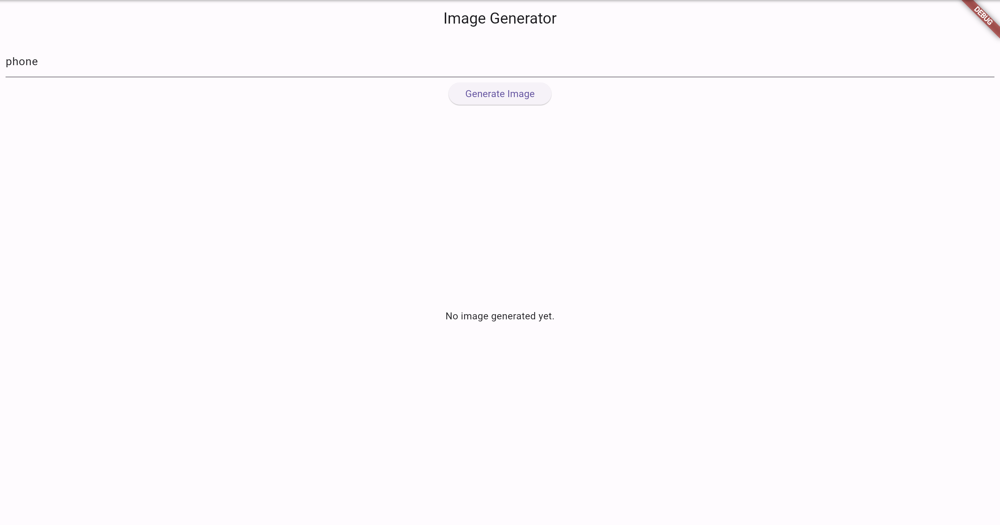
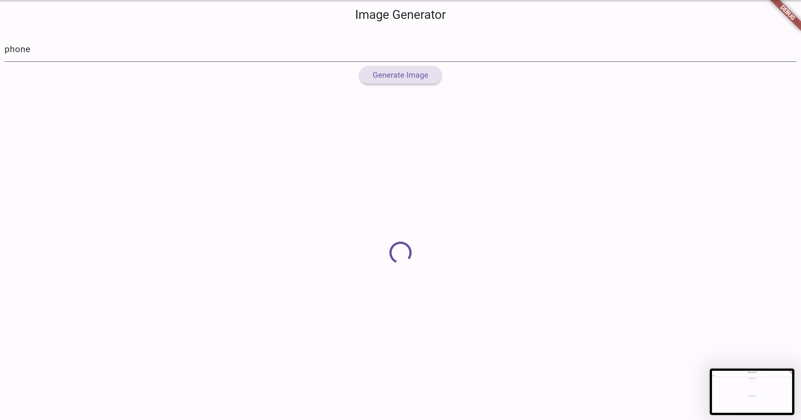
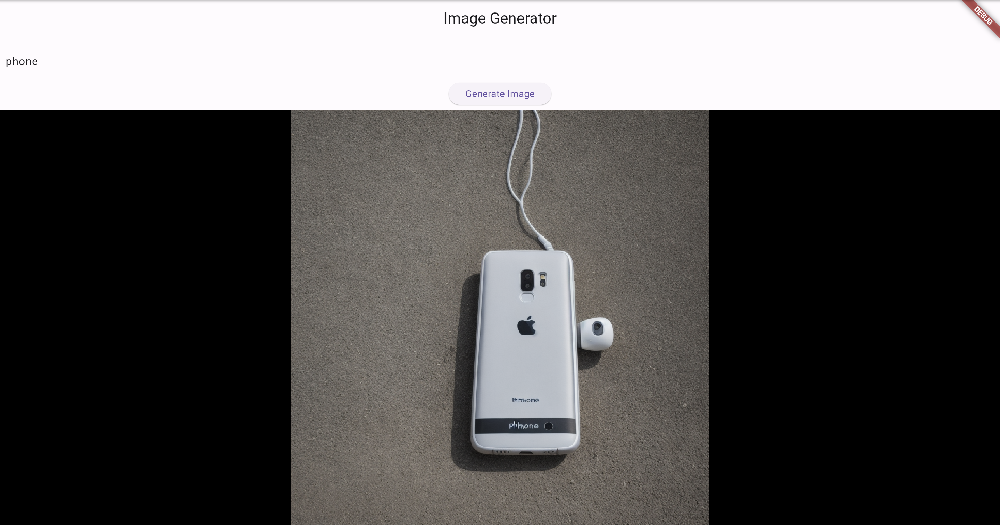

>請勿使用任何 AI 工具，亦不得自行於 VS Code 安裝或使用與 AI 相關之套件，包括但不限於自動補全功能。若經查獲違規行為，將直接以 0 分計算，且不提供補考機會。
The use of any AI tools is strictly prohibited. Students are also not allowed to install or use any AI-related extensions in VS Code, including but not limited to auto-completion features. Any violation discovered will result in an automatic score of zero, with no opportunity for a retake.

# Lab 05 OpenAI APIs 

We will utilize OpenAI as an example to demonstrate how to leverage existing AI generation providers and their APIs to meet requirements and retrieve generated content. (Alternatively, you may explore other APIs capable of producing images from text.)

## Description

Please visit the [OpenAI API Platform](https://platform.openai.com/home) to obtain your API key. You can follow the steps outlined in the [PDF](OpenAI.pdf) to complete the pricing setup.

## Grading
You can employ Flutter to exhibit an image generated after processing text through the API. **(100%)**  

Example of results:
Enter phone（or other prompt) and press Generate Image to display the image below.
   
   
   

## Deadline
Ensure your work is directly evaluated by teaching assistants before 2026/04/09 (Thur.) 17:20:00.

The score you have done will be 100%.

## Resources
- [OpenAI API image generation docs](https://developers.openai.com/api/docs/guides/image-generation?api=image#content-switcher-api)
- [OpenAI API cURL](https://developers.openai.com/api/reference/overview)
- [Send data to internet](https://docs.flutter.dev/cookbook/networking/send-data)

## Whitelist Website
- [Flutter docs](https://docs.flutter.dev/)
- [OpenAI (or other LLM API) docs](https://developers.openai.com/api/reference/overview)
- [GitLab](https://shwu10.cs.nthu.edu.tw/courses/software-studio/2026-spring)
- [Course Website](https://nthu-datalab.github.io/ss/)
- [pub.dev](https://pub.dev/)
- [Dart API docs](https://api.flutter.dev/)
