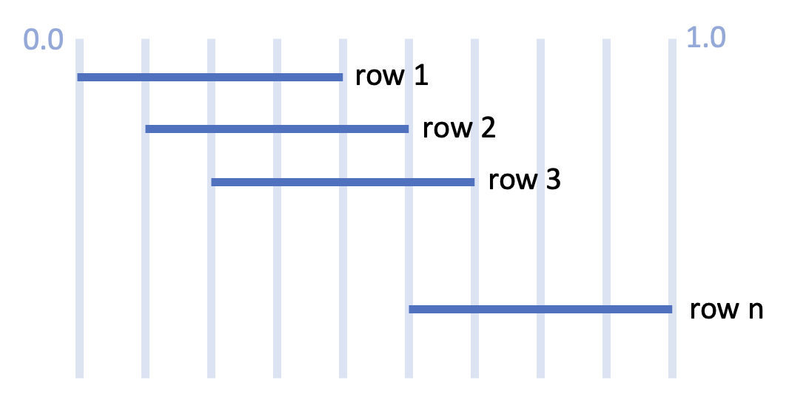

# Lab 08 Meals app with Staggered animations 

During this lab session, you will need to implement a **staggered animation effect at each row of items in home_categories_tab.dart**, the finished effect should look like sometihing below.

# Video demo


# Reading Before Starting

## Lab Rule and How to Register Demo

- [Lab FAQ -eng: command to run, git problem(clone, conflict, push reject, etc.)](FAQ-eng.pdf)
- [Lab FAQ -mandarin](FAQ-mandarin.pdf)
- [Clone by ssh](Setup_Git_SSH_Key.pdf)
- [View the Flutter Doument Faster](Using_Zeal_to_View_Flutter_and_Dart_Document.pdf)
- [Demo and Lab Guidelines](Demo___Lab_Guidelines.pdf)
- Please double-check that your target branch is correct.
- Submitting to the wrong branch will result in a 40% penalty (a maximum score of 0.6).
- For the late submission, please "resend a new merge request." And make sure your source branch and target branch is correct.

The platform you can use: Android studio emulator, web chorme, ~~windows~~


# Command to start the app
```
flutter pub get --offline
flutter run --no-pub
```

# Description
In the current state of the meals app, in the **HomeCategoriesTab** widget, the meal categories are already animated as a whole and performs a simple slide in animation from below. In this lab, we want you to implement the slide in effect **row by row** (Staggered animation). 

The animation should occour everytime that the items bulids, for example, switching from favorites tab to categories tab.

Keep in mind that in order to achieve the smoothness of animation effects in the example video, **there's some math involved**, such as calculating the start and end time of the animation, or some animation overlapping. 

The following is an example of the animation timeline, where the X axis is the value of the Animation controller.


# Grading


1. App compiles and runs with all of it's original functions  **(20%)**  
  

2. Implement the staggered animation to each row of the categories tab, we only grade on whether each row palys the animation sequentially, smoothness and aesthetics are not graded.**(80%)** 


# Hints
- Go through the thought tutorial provided below and pay special attention to the **Interval** class since it's used to delay the animation curve.

- Each item in the grid view acts differently, so you may need to apply animation to each of them separately.

- Refer to other existing animations in this project and see how they do the implementations

- Consider using GridView.builder constructor


# Deadline
Submit your work before 2026/05/14 (Thur.) Lab ends.

The score you have done will be 100%.

Submit your work before 2026/05/14 (Thur.) 23:59:59.

The score of other part you have done after 17:20:00 will be 60%.

# Resources

A few introductory tutorials crafted to assist you in completing today's lab.


- [Staggered animation tutorial](https://docs.flutter.dev/ui/animations/staggered-animations)
- [Flutter API docs](https://api.flutter.dev/)


