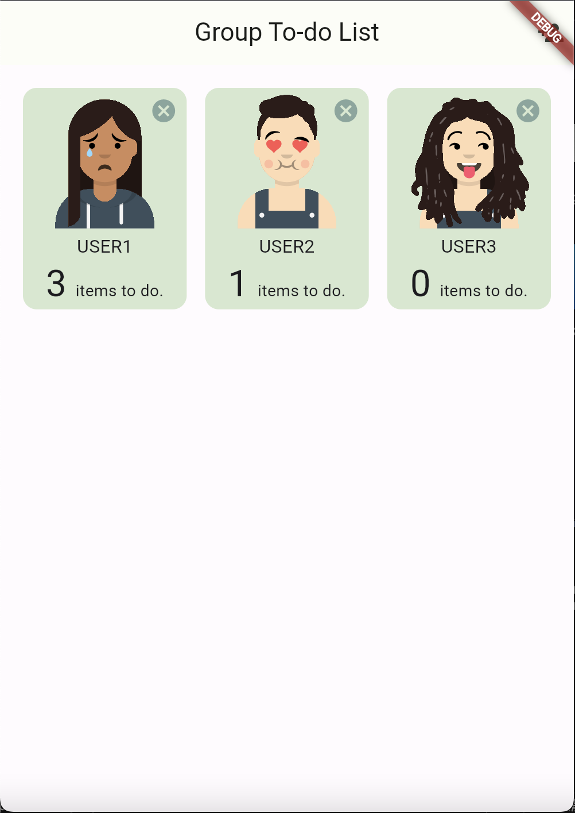
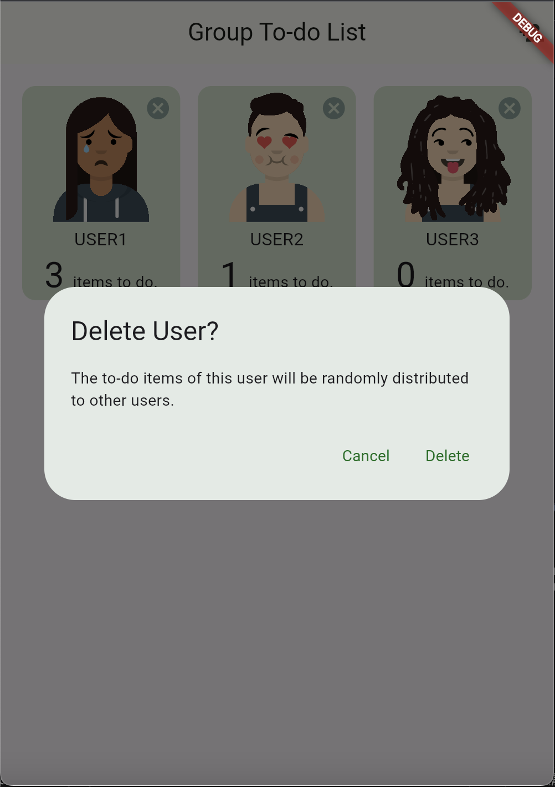
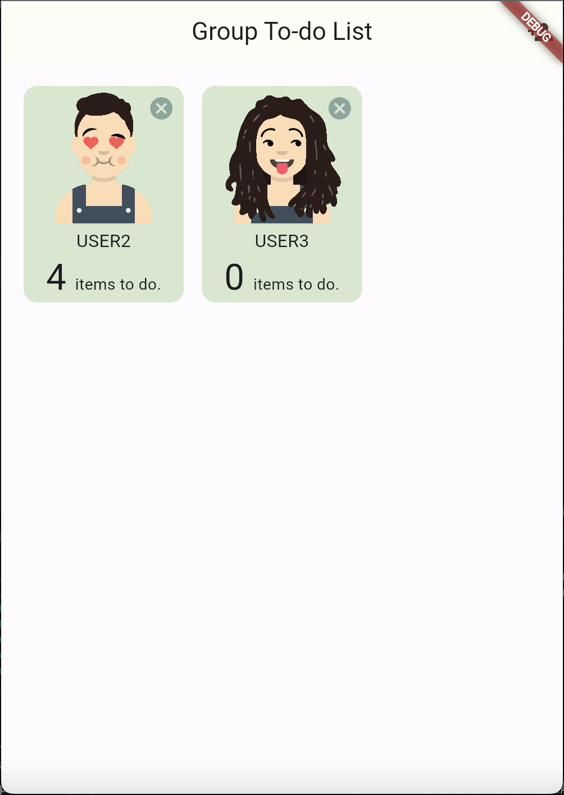

# Tutorial

[Firebase setup tutorial](https://nthu-datalab.github.io/ss/slides/2026-ss/lab09_tutorial.pdf)

Requirement: Please create a Firebase project and enable Firestore and Cloud Functions before running the setup. Note: enabling Cloud Functions may require enabling billing and adding a credit card to the project.

## Firebase / FlutterFire setup
We provide `setup_firebase.bat` to automatically configure Firebase and FlutterFire for this project. Please run the batch file, then close and reopen VS Code when it finishes. After reopening, run `flutter pub get` to install Dart/Flutter dependencies — you should then be able to use Firebase and FlutterFire commands (for example `flutterfire` or `firebase`).

If you still encounter errors or the commands are not available, please install the Firebase CLI manually:

```bash
npm install -g firebase-tools
```

See the Firebase CLI docs for more details: https://firebase.google.com/docs/cli

# Lab 8 group todo list app
In the previous lab, you successfully established the project's framework, enabling functionalities to add users and their respective to-do items. This lab focuses on enhancing the app by implementing user deletion functionality and reassign to-do items of the deleted user to remaining users.

## Description
Since there's no delete function in our app. First, you should add a “delete” button at top-right corner of user grid item.
Upon clicking the delete button, display a confirmation dialog to prevent accidental deletions. Confirming the deletion should subsequently remove the user from the database.




<br>
While deletion operations via Firestore API are not recursive, to-do items under deleted user document are orphans. So, you should write an idempotent cloud function to re-distribute orphan items to one of the other users.



## Video Demo
[Youtube](https://youtu.be/0Nqf-ajnULk)

## Grading

### NOTICE
Today's lab will be **directly evaluated** by TA. However, you still needs to send merge request to this repo.
You need to send a merge request and the TA will merge it at the time of grading.
Since we will still check your code. **PLAGIARISM IS NOT ALLOW**.

Still, there can be 60% version. Just send the merge request before **2026/5/28 23:59**.

### Criteria
- **User Deletion UI**(20%) Add a delete button. When button is pressed, show a confirm dialog.

- **User Deletion Functionality**(20%) Press delete in confirm dialog, delete the user.

- **Orphan Item Re-distribution**(60%) Randomly re-distribute orphan items to one of the other users.


## Hints

- Extend code in **/lib/repositories** and **functions** folders. (Not only these two)

- Remember to redeploy after you update function :)

- Utilize **transactions** to ensure database consistency during user deletion and item re-distribution.

- Implement **idempotency keys** to prevent duplicate operations, enhancing the robustness of your Cloud Functions.

- Edge case: when there are no other users, just delete the orphan to-do items

# Resource
- https://javascript.info/async
- https://firebase.google.com/docs/cli
- https://firebase.google.com/docs/functions
- https://firebase.google.com/docs/firestore/manage-data/transactions
