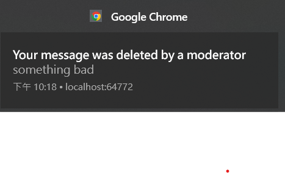

## Awareness of the lab
This week's lab builds directly on the **Authentication & Storage** setup you completed last week. Before writing any code, please carefully follow the repository setup instructions below:

### 1. GitLab Remote Setup
* This page only provides the lab criteria and a tutorial for message pushing.
* ⚠️ **IMPORTANT:** **DO NOT** clone or fork this repository to your local machine. 
* Just work on the existing project you forked and cloned from the [repository](https://shwu10.cs.nthu.edu.tw/courses/software-studio/2026-spring/lab-flutter-basics-dart-group-chat-app).

### 2. Local Project Setup
* Continue working directly on your **existing local project** from last week (the one with Authentication and Storage already configured).

### 3. Development & Submission
* Complete the lab requirements below using your original local project .
* When you are ready to submit, please follow the guidelines in the [How to submit your lab code on today's lab](Submit_your_Lab_code.pdf).

## Setup for push notification
Follow the [tutorial setup for push notification](/Setup_for_push_notification.pdf)

Please make sure that the index.js file in your functions folder matches the one in this repository. 
Then deploy it using `firebase deploy --only functions`. If the deployment is successful, you should see four Cloud Functions in your Firebase console. If you encounter an error during deployment, make sure your Node.js version is set to 20. If not, run `fnm install 20` followed by `fnm use 20` then cd function folder and run `npm install`. After that, try deploying again — it should work.

# lab-flutter-basic-dart-group-chat-app

## Check Again
 Checkout the following steps:
1. Already enable storage in firebase.
2. Paste vapid key in push_messaging.dart correctly.
3. Check if your setting in web/firebase-messaging-sw.js and firebase.json are the same.
4. Make sure your rules path of storage is correct in firebase.json. 
5. Deploy function, storage and firestore again.(rules deployment is optional)
6. Run flutterfire configure in terminal.

## Description

If you set up correctly and follow profecessor's instructions to set a user to a moderator in database, you will be able to delete message as a moderator.
In this lab, you're should send push notification to specific users whose messages were deleted.

- title: "Your message was deleted by a moderator"
- Body: "<"Deleted message text">"

## Video Demo
[Youtube] (https://youtu.be/Gc7rgnfB9n0)

## Grading

### NOTICE
Today's lab will be **directly evaluated** by TA. However, you still needs to send merge request to this repo.
You need to send a merge request and the TA will merge it at the time of grading.
Since we will still check your code. **PLAGIARISM IS NOT ALLOW**.

Still, there can be 60% version. Just send the merge request before **2026/6/11 23:59**.

### Criteria
Delete notification(100%): Send notification to specific user whose message is deleted.

## Hints
- You might need to **re-deploy** functions with `firebase deploy --only functions:<YOUR_FUNCTION_NAME>` if you modify anything .
- You might need to **save the device tokens of users** in database. You will need this token to send push notification to specific user.
- Use Cloud Function to send push notification to specific user on **message deletion** event. ( `onDocumentDeleted()` )
- You can modify index.js and push_messaging.dart.

# DEMO Test Cases:
1. Test whether a notification is triggered when a moderator deletes a message while the app is running in the background. (Expected: Yes)
2. Test whether a notification is triggered when a moderator deletes a message while the app is in the background and the deleted user has already logged out. (Expected: No)

## Reference
1. [Send a message using Firebase Admin SDK](https://firebase.google.com/docs/cloud-messaging/send/admin-sdk?hl=zh-tw)
1. [Cloud Firestore triggers](https://firebase.google.com/docs/functions/firestore-events?hl=zh-tw)
