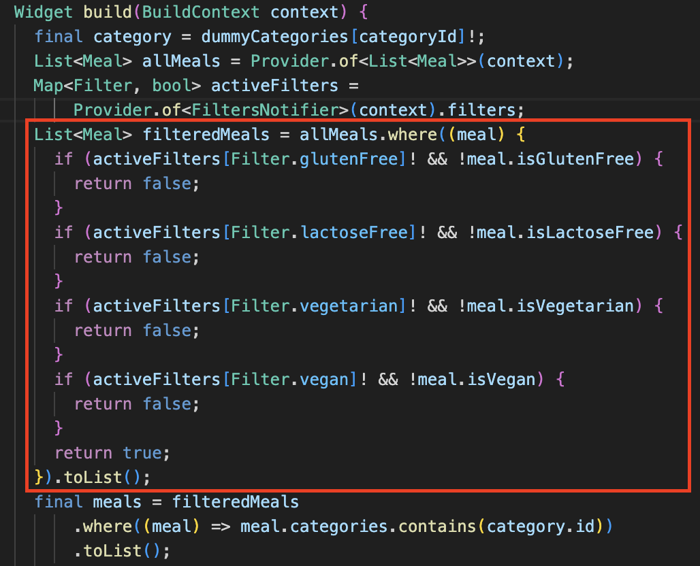
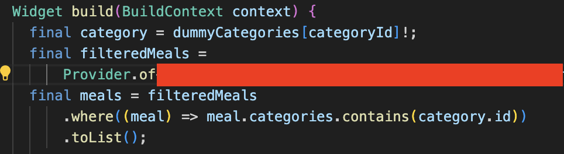

> 請勿使用任何 AI 工具，亦不得自行於 VS Code 安裝或使用與 AI 相關之套件，包括但不限於自動補全功能。若經查獲違規行為，將直接以 0 分計算，且不提供補考機會。The use of any AI tools is strictly prohibited. Students are also not allowed to install or use any AI-related extensions in VS Code, including but not limited to auto-completion features. Any violation discovered will result in an automatic score of zero, with no opportunity for a retake.

# Reading Before Starting

## Lab Rule and How to Register Demo

- [Lab FAQ -eng: command to run, git problem(clone, conflict, push reject, etc.)](FAQ-eng.pdf)
- [Lab FAQ -mandarin](FAQ-mandarin.pdf)
- [Clone by ssh](Setup_Git_SSH_Key.pdf)
- [View the Flutter Doument Faster](Using_Zeal_to_View_Flutter_and_Dart_Document.pdf)
- [Demo and Lab Guidelines](Demo___Lab_Guidelines.pdf)
- Please double-check that your target branch is correct.
- Submitting to the wrong branch will result in a 40% penalty (a maximum score of 0.6).
- For the late submission, please "resend a new merge request." And make sure your source branch and target branch is correct.

## Command to start the app
```
flutter pub get --offline
flutter run --no-pub
```
The platform you can use: Android studio emulator, web chorme, ~~windows~~

# Lab 06 Meals app with ProxyProvider

During this lab session, you will need to **implement a ChangeNotifierProxyProvider2** globally and listen to a **FilteredMealsNotifier**, if implemented correctly, the **MealsPage** can acquire the **filteredmeals** list from the provider directly, instead of re-computeing filteredMeals in every calling of it's build function.  

The lab project (courses > software-studio > 2026-spring > lab-flutter-basics-dart-meals-app) provides the meals app before implementing the proxyProvider.


# Description
In the current state of the meals app, in the **Mealspage** widget, the filteredMeals are re-computed in every calling of build, this is obviously inefficient because not every update of the MealsPage contain changes in the filteredMeals list, so re-computing it everytime creates system overhead.  

With the knowledge of **flutter providers** you've learnt from the lecture, it's easy for us to consider using providers to rewrite this so that **filteredMeals** is recomputed only when filters change, and this is exactly what you're required to do.

In order to calculate the filtered meals, you need to acquire the total meal list and the currently enabled filters, ~~Unfortunately~~ but these information are alreadly stored in a **changeNotifier** type class and provided by providers, so we'll have to use the **proxyproviders** mentioned in the lecture.


# Code explaination


*In MealsPage,  we want this part to be provided by a provider, so it becomes something like the code below.*





# Grading

Because this lab has no visible changes in the app itself, so we'll went through your code to see if there's correct implementions.


1. App compiles and runs with all of it's original functions  **(20%)**  
  

2. Let the **filteredMeals** in **MealsPage** use **FilteredMealsNotifier** provided by ChangeNotifierProxyProvider2 globally **(80%)**


# Hints
- Go through the thought process of creating and using a provider, then examin where to implement each parts of the code 

- Refer to other existing providers in this project and see how they do the implementations

- there's a empty dart file **filtered_meals_notifier.dart** under /state folder, implement the new notifier and the calculations there.

- You’ll use Dart’s cascade operator “..” when defining the “update” properity of ChangeNotifierProxyProvider2


# Deadline
Submit your work before 2026/04/30 (Thur.) 17:20:00.

The score you have done will be 100%.

Submit your work before 2026/04/30 (Thur.) 23:59:59.

The score of other part you have done after 17:20:00 will be 60%.

# Resources

A few introductory tutorials crafted to assist you in completing today's lab.


- [ProxyProvider](https://pub.dev/packages/provider#proxyprovider)
- [ChangeNotifierProxyProvider2](https://pub.dev/documentation/provider/latest/provider/ChangeNotifierProxyProvider2-class.html)


